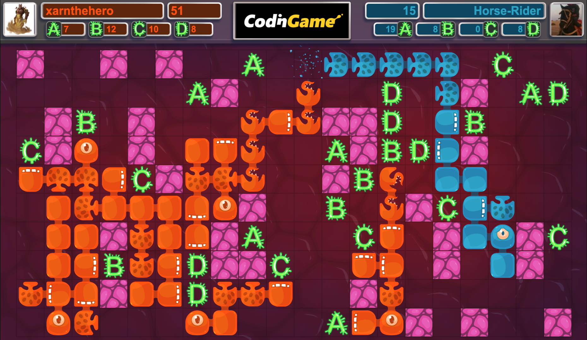

<!-- Improved compatibility of back to top link: See: https://github.com/othneildrew/Best-README-Template/pull/73 -->

<!--
*** Thanks for checking out the Best-README-Template. If you have a suggestion
*** that would make this better, please fork the repo and create a pull request
*** or simply open an issue with the tag "enhancement".
*** Don't forget to give the project a star!
*** Thanks again! Now go create something AMAZING! :D
-->

<!-- PROJECT SHIELDS -->
<!--
*** I'm using markdown "reference style" links for readability.
*** Reference links are enclosed in brackets [ ] instead of parentheses ( ).
*** See the bottom of this document for the declaration of the reference variables
*** for contributors-url, forks-url, etc. This is an optional, concise syntax you may use.
*** https://www.markdownguide.org/basic-syntax/#reference-style-links
-->

<h3 align="center">Bot Programming Competitions on codingame.com</h3>

<!-- ABOUT THE PROJECT -->
## About The Project

This project is a compilation of entries for bot competitions for the site [CodinGame](https://www.codingame.com).
The most recent entry is for their [Winter 2024 Challenge](https://www.codingame.com/contests/winter-challenge-2024)
where your program controls an organism that harvests resources, expands across the map, and attacks the enemy:

<h3> About the Cellular Arena competition (Winter 2024)</h3>

* Every turn, your bot is given the game state (position of all game objects, 
opponent's resource count, etc.)
* You are given 1 second on the first turn and 50ms on subsequent turns to write your move(s)
* Your bot must be written in one file and not exceed 100,000 characters

The competition lasted 18 days over the winder holiday season in 2024.

I enjoyed this game and would guess I put in around 60 hours into my bot,
getting as high as 33rd place in the middle section of the competition.
In the late stages, I started running into timeout problems, likely due to garbage collection, and didn't recover.
It's likely I would have been in the top 100 if I had spent more time cleaning up the timeout problems, but at
the end of the day this was a fun competition and I only wanted to participate while I was enjoying it.
Many of my final submission losses were due to turn 1 or 2 timeouts on large maps.

I ended at 298th place with 3,900 total entries.

<h3>Observations and Challenges</h3>
- Kept code well organized, although next time I'll code in multiple files and class combiner
    - Java example - https://github.com/wala-fr/CodingameFramework
- Garbage collection is a killer, reinforced by the fact that the top 14 entries are all C++
    - Next competition would be a good opportunity to learn Rust
- Code for pathfinding, grid driver, logging, code timing, and other utilities will be applicable to most other competitions
- Keeping a "todo list" with small, helpful changes kept my motivation and enjoyment high
    - See [Analysis.txt](CellularArena/Analysis.txt)
- Understanding timeouts better is something I would put time into next time
    - Debugging garbage collection times
    - Understanding variance in their game engine's timeout decisions

<h3>Strategy</h3>

My overall strategy was based on each organism evaluating different actions it could take, scoring
them based on the game state, and taking the highest scoring action (called *merit* in the project).

For example, an organism may evaluate these options:
* Create a harvester on tile (1,1): 10 merit
* Create a harvester on tile (3,4): 12 merit
* **Create an attacker on tile (7,6): 22 merit**
* Expand to cell (1,1): -3 merit
* Wait: 0 merit

After an organism takes an action, I would update my current resources and the tile with what
was built so other organisms make decisions based on this new state.
